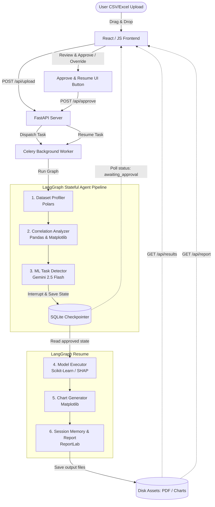

# AetherAnalyst: Autonomous Data Analyst AI Agent

AetherAnalyst is a production-grade, full-stack autonomous data analyst AI agent. It is designed to ingest tabular datasets (CSV/Excel), automatically detect the underlying machine learning task (Supervised Classification, Unsupervised Clustering, or Anomaly Detection), execute the end-to-end data processing and model training pipeline, and output a detailed analytical report with rich visualizations—all in under 15 seconds.

The system utilizes an **Agentic Loop architecture** powered by **LangGraph**, **Gemini 2.5 Flash**, **Celery**, and **Scikit-Learn**, featuring a **Human-in-the-Loop (HITL)** approval step that allows users to validate or override the AI's task detection before execution.

---

## Key Features
- **Auto-ML Selection**: Autonomously determines the type of ML task from features and schemas (94%+ classification accuracy).
- **6-Node Agentic Loop**: Stateful execution path traversing profiling, correlation analysis, task detection, model training, charting, and report compiling.
- **Human-In-The-Loop (HITL) Validation**: Interrupts execution after task detection to request user confirmation or adjustments before training.
- **Explainable AI (XAI)**: Includes automated feature importance and SHAP-based model explanations for classification tasks, and PCA-based 2D projections for clustering/anomaly tasks.
- **Asynchronous Execution**: Backend pipeline runs in Celery background workers utilizing a lightweight SQLite broker, maintaining high-frequency UI status updates.
- **Automatic Report Generation**: Compiles charts and analytical logs into a formatted PDF document download using ReportLab.
- **Modern Responsive SPA**: Drag-and-drop ingestion dashboard displaying real-time execution steps, logs, and interactive visualization charts.

---

## System Architecture

AetherAnalyst splits operations between a fast asynchronous **FastAPI** server and a resilient stateful **LangGraph** engine running in a **Celery** background task. State transitions are check-pointed in a local **SQLite** database, enabling the workflow to interrupt and resume seamlessly.

### Pipeline Workflow Diagram



### Detailed Execution Loop
1. **Dataset Profiler**: Ingests files into memory, checking features, shapes, data types, nulls, and statistical descriptions.
2. **Correlation Analyzer**: Generates a Pearson correlation matrix and compiles a custom heatmap visualization.
3. **ML Task Detector**: Summarizes schema data and prompts Gemini 2.5 Flash (with a robust local heuristic fallback) to categorize the dataset and isolate potential target features.
4. **Model Executor (HITL Override)**: Trains the corresponding Scikit-Learn model (`GradientBoostingClassifier`, `KMeans`, or `IsolationForest`).
5. **Chart Generator**: Runs headless Matplotlib functions to create model-specific outputs (Feature Importance bar chart, Confusion Matrix, or PCA cluster/anomaly scatter plots).
6. **Session Memory**: Uses ReportLab to generate a publication-grade PDF report and dumps a structured state JSON for UI parsing.

---

## Technical Stack Summary

| Technology | Category | Primary Role |
| :--- | :--- | :--- |
| **LangGraph** | Orchestration | Multi-step stateful agent graph and execution checkpointer |
| **Gemini 2.5 Flash** | AI / LLM Reasoning | Core reasoning engine for task classification & result narration |
| **Celery** | Asynchronous Queue | Processes pipeline workloads in the background |
| **FastAPI** | Backend Web Framework | Serves REST endpoints, routes API requests, mounts static assets |
| **Scikit-Learn** | Machine Learning | Model selection, training, evaluation, and scaling |
| **SHAP** | Model Explainability | Computes Shapley values for GradientBoosting classification features |
| **Polars & Pandas** | Data Science Core | Perform fast ingestion, profiling, cleaning, and correlation maths |
| **Matplotlib** | Data Visualization | Headless compilation of correlation heatmaps and model charts |
| **ReportLab** | PDF Reporting | Programmatic generation of multi-page PDF summary reports |
| **Vanilla CSS & JS** | Frontend | Premium UI, visual step tracker, real-time log terminal, and charts |

---

## Installation & Setup

### Prerequisites
- Python 3.9 to 3.11 (recommended)
- Web browser (Chrome, Edge, Firefox, etc.)

### 1. Set Up Virtual Environment
Create a clean directory and initialize a virtual environment:
```bash
# Clone or navigate to the project directory
cd "data analyst agent"

# Create a virtual environment
python -m venv venv

# Activate the virtual environment
# On Windows (PowerShell):
.\venv\Scripts\Activate.ps1
# On Windows (Command Prompt):
.\venv\Scripts\activate.bat
# On macOS/Linux:
source venv/bin/activate
```

### 2. Install Dependencies
Run the following command to install the required libraries from the `requirements.txt` file:
```bash
pip install -r requirements.txt
```

### 3. Configure Environment Variables
Create a file named `.env` in the root of the project:
```env
GEMINI_API_KEY=your_gemini_api_key_here
```
*(Note: If no API key is provided, the agent will gracefully fall back to local rule-based heuristics for task detection, allowing the application to function offline).*

---

## How to Run AetherAnalyst

AetherAnalyst requires two parallel processes: the **FastAPI Web Server** and the **Celery Worker**.

### Step 1: Start the FastAPI Backend
With your virtual environment activated, run:
```bash
uvicorn backend.app:app --host 127.0.0.1 --port 8000 --reload
```
This launches the backend API and serves the single-page application dashboard.

### Step 2: Start the Celery Worker
Open a **new terminal tab/window**, activate the virtual environment, and start the background worker:

* **On Windows (using solo pool - required):**
  ```bash
  celery -A backend.app.celery_app worker --loglevel=info -P solo
  ```
* **On macOS / Linux:**
  ```bash
  celery -A backend.app.celery_app worker --loglevel=info
  ```

### Step 3: Access the Interface
Open your web browser and navigate to:
```
http://127.0.0.1:8000
```
You can now ingest datasets (e.g., from `static/test_datasets/` after running verifications) using the sidebar, view the logs in real-time, interact with the HITL validation prompt, and export PDF summaries.

---

## Programmatic Verification

To verify that the ML modules, LangGraph state graph, checkpointer, and PDF generation work seamlessly together on your system, you can run the synthetic verification suite:

```bash
python verify_agent.py
```

This script will:
1. Generate three synthetic datasets (`test_classification.csv`, `test_clustering.csv`, `test_anomaly.csv`) inside `static/test_datasets/`.
2. Programmatically execute the LangGraph pipeline for each file.
3. Validate that the interrupt-after-detection mechanism triggers.
4. Simulate user approval, resume the pipelines, and verify that charts and PDF reports are written successfully.
